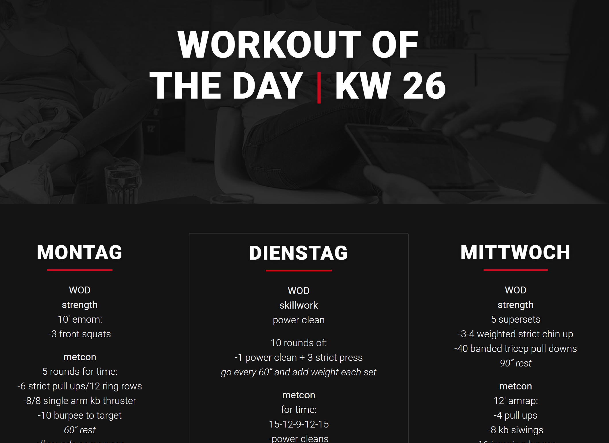

# WoD Scraper
Every Sunday my gym (https://crossfitarch.com/) releases a workout-schedule for the upcoming week on their website. However, these updates are posted at irregular times which typically leaves me anxiously checking their website over and over again, impatiently waiting for the new plan to appear. In order to relieve me from this burden and practice a little webscraping along the way, I automated this process with Python and Cron.

This script scrapes the gym's website, checks the week number of the header and sends out an e-mail with the new workouts if they are available already.

## Website view
This is how the workout schedule looks on my gyms website (I did of course not create the website, this project revolves around parsing its content):  

## E-Mail view
This is what the text of the generated e-mail notification looks like:  

